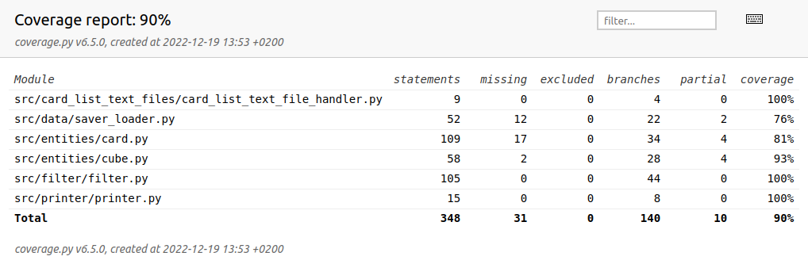

# Testaamisesta

 Sovelluslogiikkaa on testattu yksikkötesteillä. Käyttöliittymiä manuaalisesti.

saver_loaderista jäi testaamatta jo olemassa olevan cuben päälle tallentaminen ja olemattoman cuben lataamisen yritys sekä 2 kohtuu mitätöntä ehtolauseen haarautumista. Card-olion testaamisessa koin haasteeksi pakottaa hakemaan kortti api:n kautta, koska ensisijaisesti haetaan tietokannasta ja internetistä haetut kortit lisätään tietokantaan. Eli jos laittaisin testiin uuden kortin, se olisi uusi vain ensimmäisellä ajolla testeissä. Cube-olion testaamisesta uupuu viimeisin lisätty ominaisuus, eli kaksipuoleisen kortin poistaminen. Tämä on todettu manuaalisesti toimivaksi
