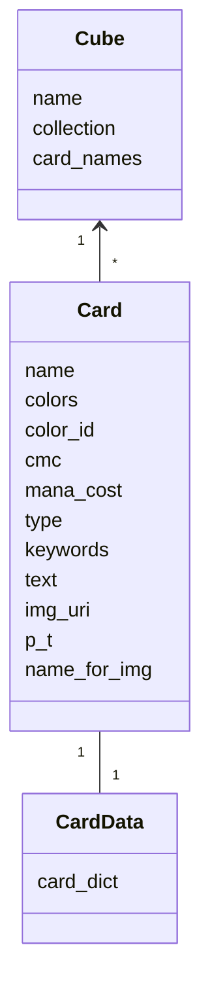

# Arkkitehtuurikuva

Luokkien puolesta sovellus on todella simppeli. CardData-luokka sisältää yksittäisen kortin datan yhtenä sanakirjana. Se on haettu ensisijaisesti fetched_cards.db tietokannasta, toissijaisesti api-kutsulla scryfall.comin tietokannoista, jonka jälkeen lisättyy kyseiseen lokaaliin tietokantaan.
Card luokka tekee CardDatan tiedosta Card-olion, joilla oleelliset tiedot attribuutteina. Cube on kokoelma Card-olioita. Sen attribuutteina ovat nimi, lista siihen kuuluvista korteista ja niiden nimistä. 

## Luokkakaavio

