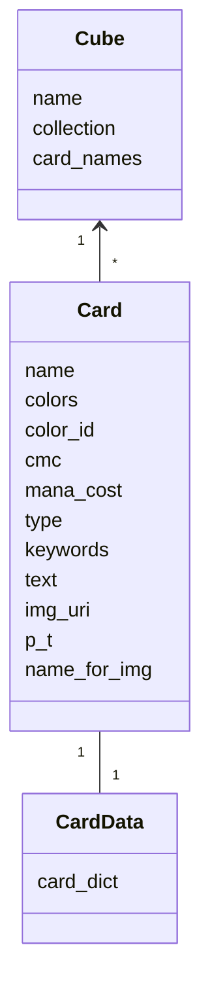
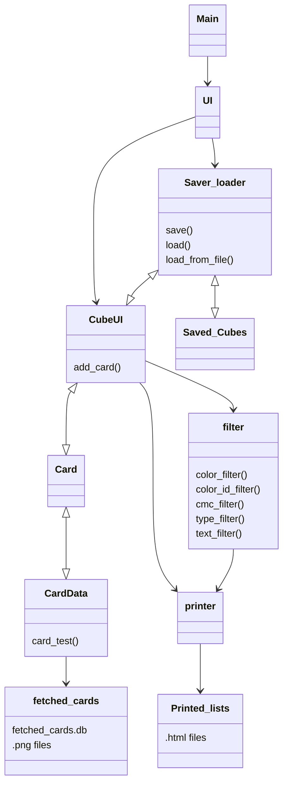
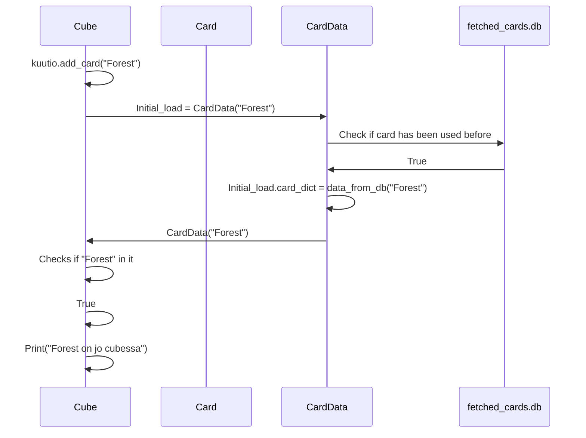

# Arkkitehtuurikuva

## Luokkakaavio

Luokkien puolesta sovellus on todella simppeli. CardData-luokka sisältää yksittäisen kortin datan yhtenä sanakirjana ja yhtenä .png-tiedostona. Se on haettu ensisijaisesti fetched_cards.db tietokannasta, toissijaisesti api-kutsulla scryfall.comin tietokannoista, jonka jälkeen lisättyy kyseiseen lokaaliin tietokantaan.
Card luokka tekee CardDatan tiedosta Card-olion, joilla oleelliset tiedot attribuutteina. Cube on kokoelma Card-olioita. Sen attribuutteina ovat nimi, lista siihen kuuluvista korteista ja niiden nimistä. 

## Pakkauskaavio

## Sovelluslogiikka

Sovellus koostuu korttikokoelmista (cube) ja korteista. Cubeja voi muokata, tarkastella ja tallentaa sekä ladata. Cubet tallennetaan .db-tiedostoina ja kortit ovat siellä yksittäisiä rivejä.

Korttia haettaessa ensimmäistä kertää ohjelma tekee api-kutsun api.scryfall.comiin ja hakee sieltä json-objektin, joka sisältää kattavasti kortin tiedot. Sovellus poimii siitä itselleen olelliset palat ja luo rivin fetched_cards.db-tiedostoon ja lataa kortin kuvan talteen. Myöhemmillä kerroilla samaa korttia hakiessa se noudetaan suoraan tästä tiedostosta.

Cuben tarkastelu tarkoittaa tällä hetkellä tulosteen tekemistä sen sisällöstä. Tulosteet ovat .html tiedostoja, jotka sisältävät joko korttien kuvat tai korttien olennaisemmat tiedot taulukoituna. Tämän lisäksi cuben sisällöstä voidaan suodattaa osia erikseen tarkasteltavaksi.

Suodattimien käyttöliittymän avaaminen luo aluksi väliaikaisen cuben, joka on kopio alkuperäisestä. Tätä kopiota voi suodattaa muutamalla eri vaihtoehdolla ja joka vaiheessa voi ottaa tulosteen ulos. Kun suodattelu lopetetaan, sovellus lataa suodattamattoman cuben takaisin. Suodattaminen tapahtuu käytännössä sql-komennoilla ja tallentamalla väliaikaisen kopion päälle suodatetut listat.

Ohjelman toimii tekstipohjaisella käyttöliittymällä, koska hienompi ei ole tarpeellinen, enkä osaa tehdä sellaista. Käyttöliittymä koostuu kolmesta tasosta. Ensimmäisessä valitaan cube käsiteltäväksi (uusi tai vanha). Toisessa on cuben käyttöliittymä, missä voi lisätä tai poistaa kortteja, tulostella, tallentaa tai suodattaaa. Viimeinen on suodattamisen käyttöliittymä, jossa avataan eri vaihtoehdot suodattamiseen.

## Sekvenssikaavio

