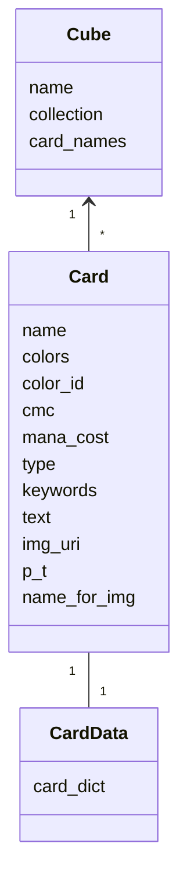
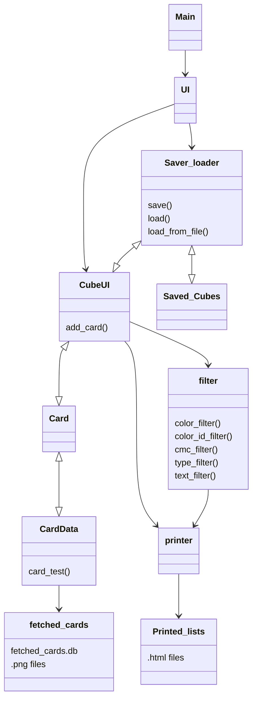
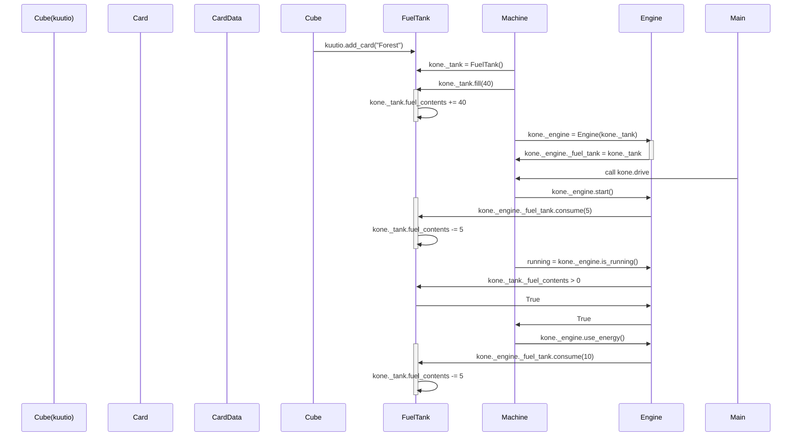

# Arkkitehtuurikuva

Luokkien puolesta sovellus on todella simppeli. CardData-luokka sisältää yksittäisen kortin datan yhtenä sanakirjana ja yhtenä .png-tiedostona. Se on haettu ensisijaisesti fetched_cards.db tietokannasta, toissijaisesti api-kutsulla scryfall.comin tietokannoista, jonka jälkeen lisättyy kyseiseen lokaaliin tietokantaan.
Card luokka tekee CardDatan tiedosta Card-olion, joilla oleelliset tiedot attribuutteina. Cube on kokoelma Card-olioita. Sen attribuutteina ovat nimi, lista siihen kuuluvista korteista ja niiden nimistä. 

## Luokkakaavio

Toiminnallisuus käy vähän monimutkaisemmaksi. main.py käynnistää UI:n, joka kysyy ladataanko tallennettu cube, luodaanko uusi cube tyhjästä vai listasta (.txt-tiedosto). Tämän jälkeen siirrytään valitun cuben kanssa CubeUI:hin ja sieltä voi tällä hetkellä:
 - lisätä kortteja
 - tallentaa cuben omana .db tiedostona (joka on sitten ladattavissa myöhemmin)
 - tulostaa cubesta .html tiedosto sisällön tarkastelua varten (kuvat tähän mukaan joskus)
 - suodattaa cuben sisältöä ja suodatetun sisällön voi tulostaa

## Pakkauskaavio

## Sekvenssikaavio

