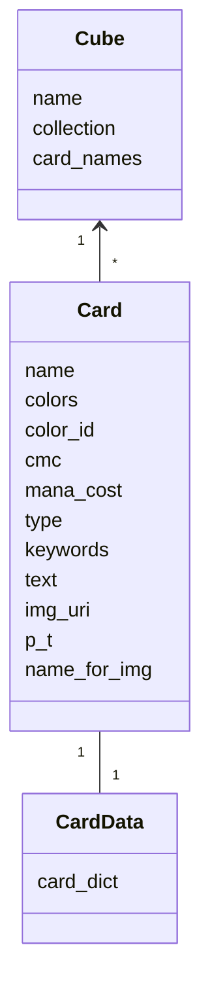

# Arkkitehtuurikuva

## Luokkakaavio

```mermaid
 classDiagram
      Cube "1" <-- "*" Card
      Card "1" -- "1" CardData
      class Card{
        name
        colors
        color_id
        cmc
        mana_cost
        type
        keywords
        text
        img_uri
        p_t
        name_for_img          
      }
      class Cube{
        name
        collection
        card_names
      }
      class CardData{
        card_dict
      }
```

