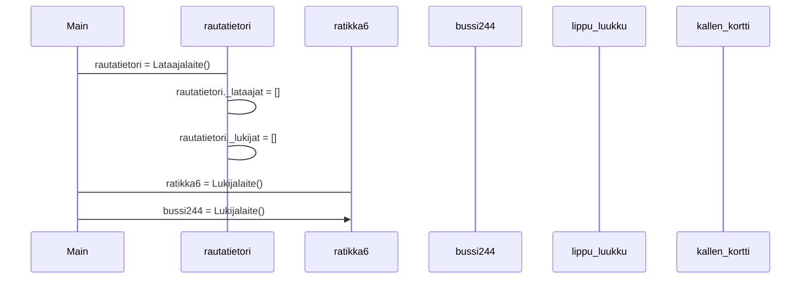

```mermaid
sequenceDiagram
  participant Main
  participant rautatietori
  participant ratikka6
  participant bussi244
  participant lippu_luukku
  participant kallen_kortti
  Main->rautatietori: rautatietori = Lataajalaite()
  rautatietori->rautatietori: rautatietori._lataajat = []
  rautatietori->rautatietori: rautatietori._lukijat = []
  Main->ratikka6: ratikka6 = Lukijalaite()
  Main->>ratikka6: bussi244 = Lukijalaite()
   
```
