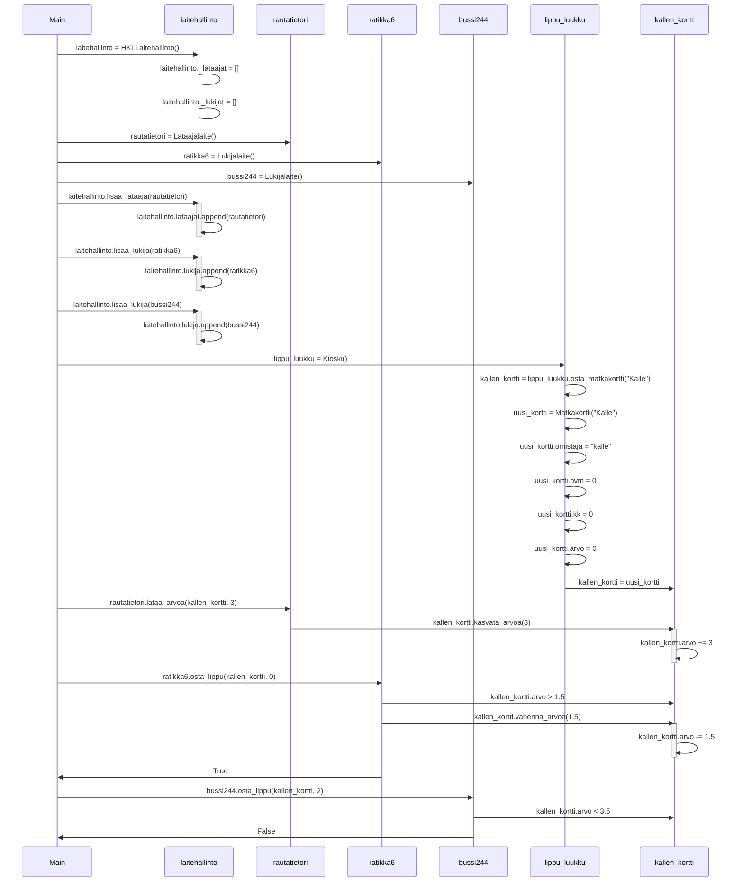

```mermaid
sequenceDiagram
  participant Main
  participant laitehallinto
  participant rautatietori
  participant ratikka6
  participant bussi244
  participant lippu_luukku
  participant kallen_kortti
  Main->>laitehallinto: laitehallinto = HKLLaitehallinto()
  laitehallinto->laitehallinto: laitehallinto._lataajat = []
  laitehallinto->laitehallinto: laitehallinto._lukijat = []
  Main->>rautatietori: rautatietori = Lataajalaite()
  Main->>ratikka6: ratikka6 = Lukijalaite()
  Main->>bussi244: bussi244 = Lukijalaite()
  Main->>laitehallinto: laitehallinto.lisaa_lataaja(rautatietori)
  activate laitehallinto
  laitehallinto->>laitehallinto: laitehallinto.lataajat.append(rautatietori)
  deactivate laitehallinto
  Main->>laitehallinto: laitehallinto.lisaa_lukija(ratikka6)
  activate laitehallinto
  laitehallinto->>laitehallinto: laitehallinto.lukija.append(ratikka6)
  deactivate laitehallinto
  Main->>laitehallinto: laitehallinto.lisaa_lukija(bussi244)
  activate laitehallinto
  laitehallinto->>laitehallinto: laitehallinto.lukija.append(bussi244)
  deactivate laitehallinto
  Main->>lippu_luukku: lippu_luukku = Kioski()
  lippu_luukku->>lippu_luukku: kallen_kortti = lippu_luukku.osta_matkakortti("Kalle")
  lippu_luukku->>lippu_luukku: uusi_kortti = Matkakortti("Kalle")
  lippu_luukku->>lippu_luukku: uusi_kortti.omistaja = "kalle"
  lippu_luukku->>lippu_luukku: uusi_kortti.pvm = 0
  lippu_luukku->>lippu_luukku: uusi_kortti.kk = 0
  lippu_luukku->>lippu_luukku: uusi_kortti.arvo = 0
  lippu_luukku->>kallen_kortti: kallen_kortti = uusi_kortti
  Main->>rautatietori: rautatietori.lataa_arvoa(kallen_kortti, 3)
  rautatietori->>kallen_kortti: kallen_kortti.kasvata_arvoa(3)
  activate kallen_kortti
  kallen_kortti->>kallen_kortti: kallen_kortti.arvo += 3
  deactivate kallen_kortti
  Main->>ratikka6: ratikka6.osta_lippu(kallen_kortti, 0)
  ratikka6->>kallen_kortti: kallen_kortti.arvo > 1.5
  ratikka6->>kallen_kortti: kallen_kortti.vahenna_arvoa(1.5)
  activate kallen_kortti
  kallen_kortti->>kallen_kortti: kallen_kortti.arvo -= 1.5
  deactivate kallen_kortti
  ratikka6->>Main: True
  Main->>bussi244: bussi244.osta_lippu(kallen_kortti, 2)
  bussi244->>kallen_kortti: kallen_kortti.arvo < 3.5
  bussi244->>Main: False
```
