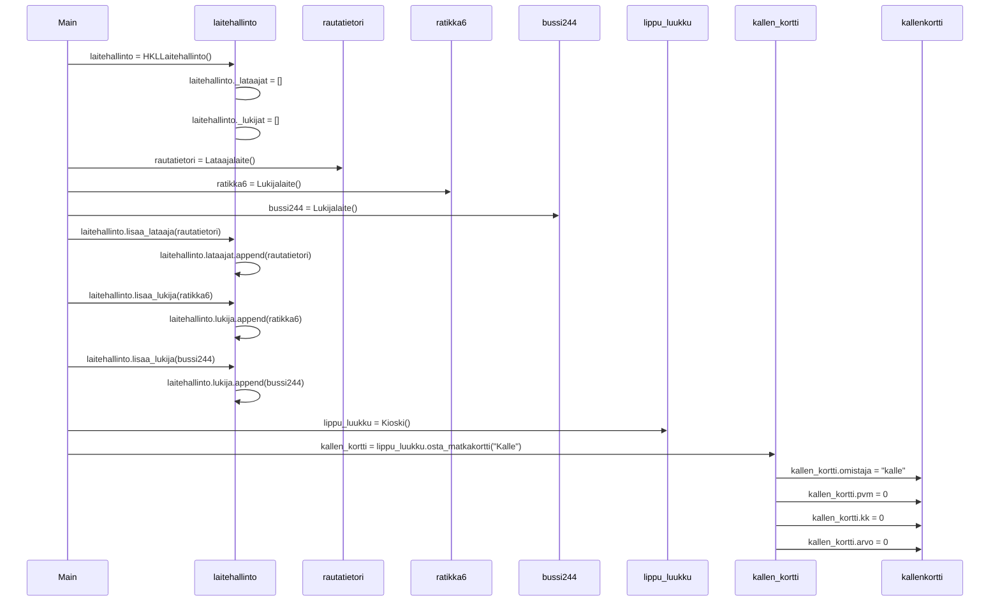

```mermaid
sequenceDiagram
  participant Main
  participant laitehallinto
  participant rautatietori
  participant ratikka6
  participant bussi244
  participant lippu_luukku
  participant kallen_kortti
  Main->>laitehallinto: laitehallinto = HKLLaitehallinto()
  laitehallinto->laitehallinto: laitehallinto._lataajat = []
  laitehallinto->laitehallinto: laitehallinto._lukijat = []
  Main->>rautatietori: rautatietori = Lataajalaite()
  Main->>ratikka6: ratikka6 = Lukijalaite()
  Main->>bussi244: bussi244 = Lukijalaite()
  Main->>laitehallinto: laitehallinto.lisaa_lataaja(rautatietori)
  laitehallinto->>laitehallinto: laitehallinto.lataajat.append(rautatietori)
  Main->>laitehallinto: laitehallinto.lisaa_lukija(ratikka6)
  laitehallinto->>laitehallinto: laitehallinto.lukija.append(ratikka6)
  Main->>laitehallinto: laitehallinto.lisaa_lukija(bussi244)
  laitehallinto->>laitehallinto: laitehallinto.lukija.append(bussi244)
  Main->>lippu_luukku: lippu_luukku = Kioski()
  Main->>kallen_kortti: kallen_kortti = lippu_luukku.osta_matkakortti("Kalle")
  kallen_kortti->>kallenkortti: kallen_kortti.omistaja = "kalle"
  kallen_kortti->>kallenkortti: kallen_kortti.pvm = 0
  kallen_kortti->>kallenkortti: kallen_kortti.kk = 0
  kallen_kortti->>kallenkortti: kallen_kortti.arvo = 0

```
