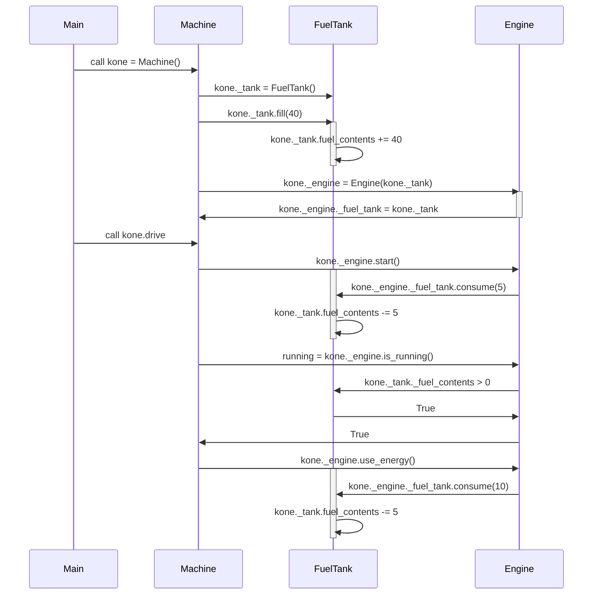

```mermaid
sequenceDiagram
  participant Main
  participant Machine
  participant FuelTank
  participant Engine
  Main->>Machine: call kone = Machine()
  Machine->>FuelTank: kone._tank = FuelTank()
  Machine->>FuelTank: kone._tank.fill(40)
  activate FuelTank
  FuelTank->>FuelTank: kone._tank.fuel_contents += 40  
  deactivate FuelTank
  Machine->>Engine: kone._engine = Engine(kone._tank)
  activate Engine
  Engine->>Machine: kone._engine._fuel_tank = kone._tank
  deactivate Engine
  Main->>Machine: call kone.drive
  Machine->>Engine: kone._engine.start()
  activate FuelTank
  Engine->>FuelTank: kone._engine._fuel_tank.consume(5)
  FuelTank->>FuelTank: kone._tank.fuel_contents -= 5
  deactivate FuelTank
  Machine->>Engine: running = kone._engine.is_running()
  Engine->>FuelTank: kone._tank._fuel_contents > 0
  FuelTank->>Engine: True
  Engine->>Machine: True
  Machine->>Engine: kone._engine.use_energy()
  activate FuelTank
  Engine->>FuelTank: kone._engine._fuel_tank.consume(10)
  FuelTank->>FuelTank: kone._tank.fuel_contents -= 5
  deactivate FuelTank
```
