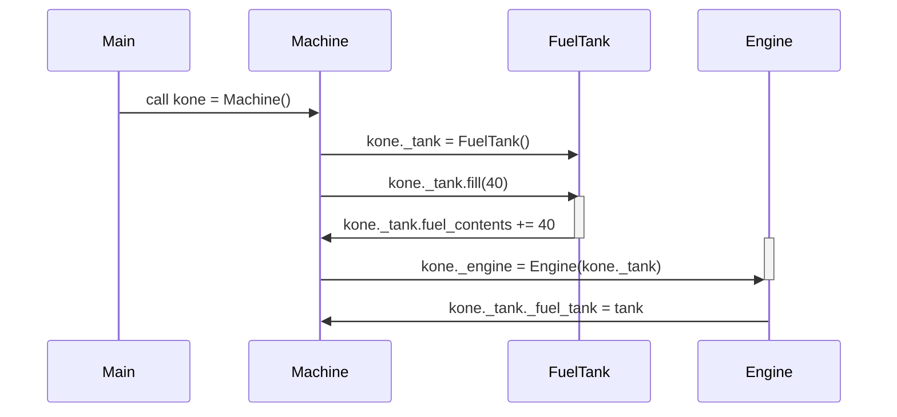

```mermaid
sequenceDiagram
  participant Main
  participant Machine
  participant FuelTank
  participant Engine
  Main->>Machine: call kone = Machine()
  Machine->>FuelTank: kone._tank = FuelTank()
  Machine->>FuelTank: kone._tank.fill(40)
  activate FuelTank
  FuelTank->>Machine: kone._tank.fuel_contents += 40  
  deactivate FuelTank
  activate Engine
  Machine->>Engine: kone._engine = Engine(kone._tank)
  deactivate Engine
  Engine->>Machine: kone._tank._fuel_tank = tank
  
```
