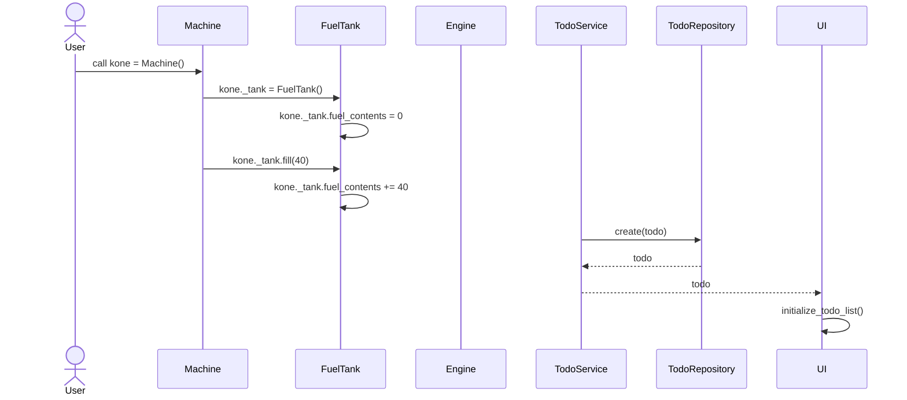

```mermaid
sequenceDiagram
  actor User
  participant Machine
  participant FuelTank
  participant Engine
  User->>Machine: call kone = Machine()
  Machine->>FuelTank: kone._tank = FuelTank()
  FuelTank->>FuelTank: kone._tank.fuel_contents = 0
  Machine->>FuelTank: kone._tank.fill(40)
  FuelTank->>FuelTank: kone._tank.fuel_contents += 40  
  TodoService->>TodoRepository: create(todo)
  TodoRepository-->>TodoService: todo
  TodoService-->>UI: todo 
  UI->>UI: initialize_todo_list()
```
