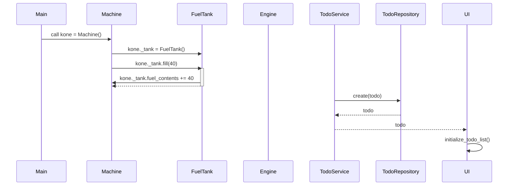

```mermaid
sequenceDiagram
  participant Main
  participant Machine
  participant FuelTank
  participant Engine
  Main->>Machine: call kone = Machine()
  Machine->>FuelTank: kone._tank = FuelTank()
  Machine->>FuelTank: kone._tank.fill(40)
  activate FuelTank
  FuelTank->>Machine: kone._tank.fuel_contents += 40  
  FuelTank-->>Machine:
  deactivate FuelTank
  TodoService->>TodoRepository: create(todo)
  TodoRepository-->>TodoService: todo
  TodoService-->>UI: todo 
  UI->>UI: initialize_todo_list()
```
